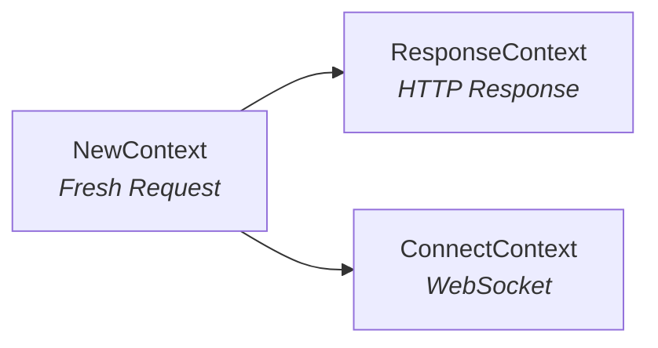
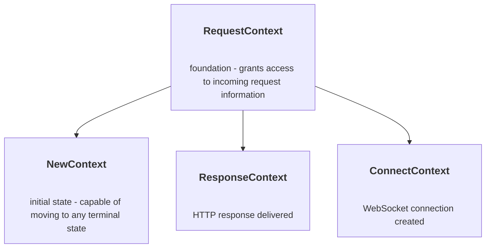

# Request context

**Context** is the heart of Relic's handler system. Think of it as a smart wrapper around an HTTP request that knows what operations are valid at each stage of processing.

:::info Context vs Request
A `Request` is just raw HTTP data (headers, body, URL). A `Context` wraps this data and adds _action methods_ (`respond()`, `connect()`, `hijack()`) plus _state management_. The context system prevents you from doing invalid things - like trying to send a response _and_ establish a WebSocket on the same request.
:::

## Quick terminology

Before we dive in, let's define a few terms you'll see throughout:

- **Middleware**: A function that wraps a handler to add behavior (like logging, auth, etc.)
- **Symbol**: A Symbol object represents an operator or identifier declared in a Dart program. Symbol literals are written with `#` followed by the identifier (like `#user`). They're compile-time constants and invaluable for APIs that refer to identifiers by name, because minification changes identifier names but not identifier symbols. Learn more about [Symbols in Dart](https://dart.dev/language/built-in-types#symbols).

## The context lifecycle

Every HTTP request follows this journey through Relic's context system:



:::info Context transitions
Every context starts as `NewContext` and transitions _exactly once_ to a final state. However, `ResponseContext` can transition to another `ResponseContext` (useful for middleware chains), while `ConnectContext` is terminal and cannot transition further.
:::

Let's start with the simplest possible Relic server to understand how contexts work:

```dart
import 'dart:io';

import 'package:relic/io_adapter.dart';
import 'package:relic/relic.dart';

void main() async {
  // This is your handler - it receives a NewContext and returns a ResponseContext
  Future<ResponseContext> handler(NewContext ctx) async {
    return ctx.respond(
      Response.ok(body: Body.fromString('Hello, World!')),
    );
  }

  // Start the server
  await serve(handler, InternetAddress.anyIPv4, 8080);
  print('Server running on http://localhost:8080');
}
```

**What's happening:**

1. Your handler receives a `NewContext` - this represents a fresh, unhandled HTTP request
2. You call `ctx.respond()` to send back an HTTP response
3. This returns a `ResponseContext` - representing that the request is now complete

That's it! Every request in Relic follows this pattern: receive a context, do something with it, return a context.

## Context types

Relic provides four context types, each representing a different stage of request processing. They form a type hierarchy:



All contexts share a common base: `RequestContext`, which gives you access to `ctx.request` (the HTTP request data).

Some contexts also implement special interfaces:

- **`RespondableContext`** - Can send responses (includes `NewContext`, also used as a parameter type to allow multiple context types)

### NewContext - The starting point

Every handler receives a `NewContext` first. This represents a **fresh, unhandled request** and gives you three choices:

1. **Send an HTTP response** → Becomes `ResponseContext`
2. **Establish a WebSocket** → Becomes `ConnectContext`  
3. **Create a modified request** → Becomes `NewContext`

| Method                       | Returns           | Description                              |
|------------------------------|-------------------|------------------------------------------|
| `respond(Response)`          | `ResponseContext` | Send HTTP response and complete request  |
| `connect(WebSocketCallback)` | `ConnectContext`  | Establish WebSocket connection           |
| `withRequest(Request)`       | `NewContext`      | Create new context with modified request |

**Example - Serving HTML:**

```dart
import 'dart:convert';
import 'dart:io';
import 'package:relic/io_adapter.dart';
import 'package:relic/relic.dart';

/// Serves an HTML home page
/// Note: The signature is Future<ResponseContext> because we use 'async'
Future<ResponseContext> homeHandler(NewContext ctx) async {
  // Create an HTML response
  return ctx.respond(Response.ok(
    body: Body.fromString(
      _htmlHomePage(),
      encoding: utf8,  // Text encoding (UTF-8 is standard)
      mimeType: MimeType.html,  // Tells browser this is HTML
    ),
  ));
}

String _htmlHomePage() {
  return '''
<!DOCTYPE html>
<html>
<head>
    <title>Relic Context Example</title>
</head>
<body>
    <h1>Welcome to Relic!</h1>
    <p>This is an HTML response created from a NewContext.</p>
</body>
</html>
''';
}
```

:::tip When to use async/await
Use `Future<ResponseContext>` and `async` when your handler needs to wait for asynchronous operations (like database queries or reading request bodies). If your handler is purely synchronous, you can omit both:

```dart
ResponseContext simpleHandler(NewContext ctx) {
  return ctx.respond(Response.ok(body: Body.fromString('Sync response')));
}
```

:::

### ResponseContext - HTTP response sent

Once you call `respond()`, the request is considered _complete_. The `ResponseContext` returned is primarily used internally by Relic's middleware system.

When you call `ctx.respond()`, you transition to a `ResponseContext`. This represents a _completed HTTP request_ with a response ready to be sent to the client.

| Property   | Type       | Description              |
|------------|------------|--------------------------|
| `response` | `Response` | The HTTP response object |

**Example - JSON API response:**

```dart
import 'dart:convert';  // For jsonEncode
import 'package:relic/relic.dart';

/// Returns JSON data
Future<ResponseContext> apiHandler(NewContext ctx) async {
  // Create a Dart Map that will be converted to JSON
  final data = {
    'message': 'Hello from Relic API!',
    'timestamp': DateTime.now().toIso8601String(),
    'path': ctx.request.url.path,
  };

  return ctx.respond(Response.ok(
    body: Body.fromString(
      jsonEncode(data),  // Convert Map to JSON string
      mimeType: MimeType.json,  // Set Content-Type: application/json
    ),
  ));
}
```

**Example - API with route parameters:**

```dart
import 'dart:convert';
import 'package:relic/relic.dart';

/// First, define the route with a path parameter
  final router = Router();
  
// Define route with :id parameter - the colon makes it a dynamic segment
  router.get('/users/:id', userHandler);

/// Handler that extracts the user ID from the URL path
Future<ResponseContext> userHandler(NewContext ctx) async {
  // pathParameters come from the router - #id matches ':id' in the route
  final userId = ctx.pathParameters[#id];  
  
  final data = {
    'userId': userId,
    'message': 'User details for ID: $userId',
    'timestamp': DateTime.now().toIso8601String(),
  };

  return ctx.respond(Response.ok(
    body: Body.fromString(
      jsonEncode(data),
      mimeType: MimeType.json,
    ),
  ));
}

// Usage: GET /users/123 will extract '123' as the #id parameter
```

:::tip Adding custom headers
Use `Headers.build()` to add custom response headers:

```dart
return ctx.respond(
  Response.ok(
    body: Body.fromString(jsonEncode(data), mimeType: MimeType.json),
    headers: Headers.build(
      (mh) => mh
        ..accept = AcceptHeader(
          mediaRanges: [MediaRange('application', 'json')],
        )
        ..cookie = CookieHeader(
          cookies: [Cookie(name: 'name', value: 'value')],
        ),
    ),
  ),
);
```

:::

### ConnectContext - WebSocket connections

Use `connect()` for WebSocket handshakes. WebSockets are a specific type of connection upgrade that Relic handles automatically.

For full-duplex WebSocket connections where both client and server can send messages independently.

| Property   | Type                | Description                     |
|------------|---------------------|---------------------------------|
| `callback` | `WebSocketCallback` | Function handling the WebSocket |

**Example - WebSocket connection:**

```dart
import 'dart:developer';  // For log()
import 'package:relic/relic.dart';
import 'package:web_socket/web_socket.dart';  // Dart's official WebSocket package

/// Establishes a WebSocket connection and echoes messages
/// Note: No Future or async on the outer function - ctx.connect() returns ConnectContext immediately
/// The async is on the callback function inside connect()
ConnectContext webSocketHandler(NewContext ctx) {
  return ctx.connect((webSocket) async {
    log('WebSocket connection established');

    // Send welcome message to client
    webSocket.sendText('Welcome to Relic WebSocket!');

    // Listen for incoming messages
    // The 'await for' loop processes events as they arrive
    await for (final event in webSocket.events) {
      switch (event) {
        case TextDataReceived(text: final message):
          log('Received: $message');
          webSocket.sendText('Echo: $message');  // Send it back
        case CloseReceived():
          log('WebSocket connection closed');
          break;  // Exit the loop when client disconnects
        default:
          // Ignore other event types (BinaryDataReceived, etc.)
          break;
      }
    }
  });
}
```

:::info WebSocket vs HTTP response
Unlike `respond()` which sends a response and closes the connection, `connect()` keeps the connection alive for bidirectional communication. The context transitions to `ConnectContext` immediately, but the callback runs asynchronously to handle messages.
:::

## Accessing request data

All context types inherit from `RequestContext` and provide access to the original HTTP request through `ctx.request`. This gives you access to all HTTP data:

### Request properties reference

| Property          | Type      | Description          | Example                                          |
|-------------------|-----------|----------------------|--------------------------------------------------|
| `request.method`  | `String`  | HTTP method          | `'GET'`, `'POST'`, `'PUT'`                       |
| `request.url`     | `Uri`     | Complete request URL | `Uri.parse('https://api.example.com/users/123')` |
| `request.headers` | `Headers` | HTTP headers map     | `request.headers.authorization`                  |
| `request.body`    | `Body`    | Request body stream  | `await request.body.readAsString()`              |

### Reading request data

The request body is a `Stream<Uint8List>`. Use `readAsString()` for text data or `readAsBytes()` for binary data.

```dart
import 'dart:convert';
import 'package:relic/relic.dart';

Future<ResponseContext> dataHandler(NewContext ctx) async {
  final request = ctx.request;

  // Access basic HTTP information
  final method = request.method; // 'GET', 'POST', etc.
  final path = request.url.path; // '/api/users'
  final query = request.url.query; // 'limit=10&offset=0'

  // Access headers (these are typed accessors from the Headers class)
  final authHeader = request.headers.authorization; // 'Bearer token123' or null
  final contentType = request.body.bodyType
      ?.mimeType; // appljson, octet-stream, plainText, etc. or null

  // Read request body for POST with JSON
  if (method == Method.post && contentType == MimeType.json) {
    try {
      final bodyString = await request.readAsString();
      final jsonData = json.decode(bodyString) as Map<String, dynamic>;

      return ctx.respond(Response.ok(
        body: Body.fromString('Received: ${jsonData['name']}'),
      ));
    } catch (e) {
      return ctx.respond(
        Response.badRequest(
          body: Body.fromString('Invalid JSON'),
        ),
      );
    }
  }

  // Return bad request if the content type is not JSON
  return ctx.respond(
    Response.badRequest(
      body: Body.fromString('Invalid Request'),
    ),
  );
}
```

:::warning Reading request bodies

- The body can only be read _once_ - it's a stream that gets consumed
- Always validate the `Content-Type` header before parsing
- Wrap parsing in try-catch to handle malformed data
- Be careful with large bodies - consider adding size limits
:::

## Context state machine

Relic's context system uses a _state machine_ to prevent invalid operations. Each context type exposes only the methods that make sense for its current state, catching errors at compile time rather than runtime.

Once you've chosen a path, you cannot backtrack. For example, after calling `respond()` to create a `ResponseContext`, you cannot change your mind and call `connect()` to create a `ConnectContext` instead. The transition is irreversible.

This makes sense because an HTTP request can only have one outcome:

- Either you send a response
- Or you upgrade to WebSocket
- Or you take raw control

Here's what the transitions look like in practice:

```dart
Future<ResponseContext> exampleHandler(NewContext ctx) async {
  // ✅ You start with NewContext - it has all the methods
  
  // Choice 1: Send an HTTP response
  return ctx.respond(Response.ok(body: Body.fromString('Hello')));
  // Returns ResponseContext - the request is now complete
  
  // ❌ Can't do anything else after respond() - the function returned!
}

ConnectContext wsHandler(NewContext ctx) {
  // Choice 2: Establish WebSocket
  return ctx.connect((webSocket) async {
    // Handle WebSocket...
  });
  // Returns ConnectContext - connection is now upgraded
}
```

## Custom context properties

Context properties let you **attach custom data** to a request as it flows through your application. Think of it like adding sticky notes to the request that any handler can read.

**Common use cases:**

- Store request IDs for logging and tracing
- Cache computed values within a request
- Pass data between middleware and handlers
- Track request-specific state

### Example usage - request ID

Here's a simple example that assigns a unique ID to each request:

```dart
import 'package:relic/relic.dart';

// 1. Create a ContextProperty to store request-specific data
final _requestIdProperty = ContextProperty<String>('requestId');

// 2. Middleware that sets a unique ID for each request
Handler requestIdMiddleware(Handler next) {
  return (ctx) async {
    // Set a unique request ID
    _requestIdProperty[ctx] = 'req_${DateTime.now().millisecondsSinceEpoch}';
    
    // Continue to the next handler
    return await next(ctx);
  };
}

// 3. Handler that uses the stored request ID
Future<ResponseContext> handler(NewContext ctx) async {
  // Retrieve the request ID that was set by middleware
  final requestId = _requestIdProperty[ctx];
  
  print('Processing request: $requestId');
  
  return ctx.respond(Response.ok(
    body: Body.fromString('Your request ID is: $requestId'),
  ));
}
```

**How it works:**

1. **Create a property** - `ContextProperty<String>('requestId')` creates a property that can store strings
2. **Store data** - Middleware sets the value: `_requestIdProperty[ctx] = 'req_123'`
3. **Retrieve data** - Any handler can read it: `_requestIdProperty[ctx]`

:::info Property lifetime
Context properties exist **only for the duration of the request**. Once the response is sent, they're automatically cleaned up.
:::

## Summary

The `RequestContext` system is the foundation of Relic's request handling architecture, providing type-safe state management that prevents entire categories of bugs at compile time. Every HTTP request flows through a carefully designed state machine that ensures proper request/response handling.

Key principles include using specific context types (`NewContext`, `ResponseContext`, `ConnectContext`) to enforce valid operations, leveraging type-safe request data access, and utilizing context properties for request-scoped data sharing. The system eliminates common pitfalls like double responses or incorrect state transitions.

This approach delivers both developer experience improvements through better IDE support and runtime safety through compile-time guarantees, making complex web applications more maintainable and reliable.

## Examples

- **[Context Types Example](https://github.com/serverpod/relic/blob/main/example/context.dart)** - Demonstrates HTTP responses, WebSocket connections, routing, and middleware
- **[Context Property Example](https://github.com/serverpod/relic/blob/main/example/context_property.dart)** - Shows how to use context properties for request IDs
