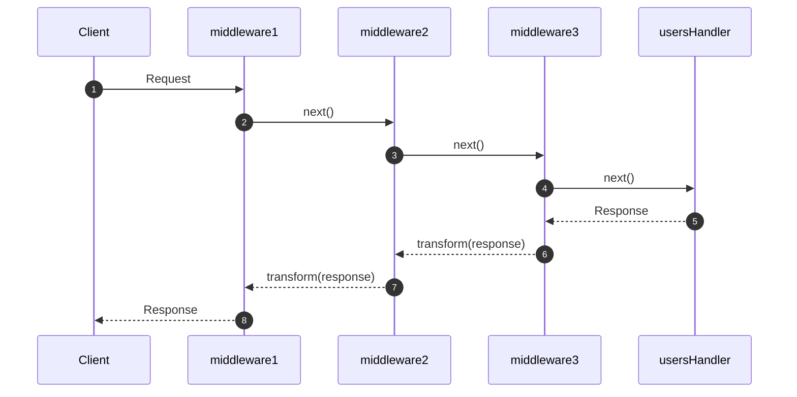

# Middleware

Middleware are the backbone of Relic's request processing pipeline. They provide a powerful pattern for composing functionality around your handlers, enabling you to add cross-cutting concerns like logging, authentication, CORS, and more in a clean, reusable way.

They work by wrapping handlers with additional functionality. Think of it as a series of layers around your core handler, each layer can inspect and modify requests before they reach your handler, and responses after they leave your handler.

## What is middleware?

A `Middleware` is a function that takes a handler and returns a new handler with enhanced functionality. This pattern allows you to compose multiple pieces of functionality together, creating a processing pipeline where each middleware layer adds its own behavior.

```dart
typedef Middleware = Handler Function(Handler innerHandler);
```

### Handler wrapping

Every middleware function receives an inner handler and returns a new handler that wraps the original. This wrapper can:

- **Inspect requests** before passing them to the inner handler.
- **Modify requests** by creating new request objects.
- **Short-circuit processing** by returning a response without calling the inner handler.
- **Transform responses** after the inner handler completes.
- **Handle errors** that occur in the inner handler.

Here's a simple example of a middleware function; it outlines the signature and the basic pattern of how middleware work:

```dart
Middleware myMiddleware() {
  return (final Handler innerHandler) {
    return (final Request ctx) async {
      // Before request processing

      final result = await innerHandler(ctx);

      // After request processing

      return result;
    };
  };
}
```

:::tip
With a middleware function, you can perform actions both before and after the inner handler executes. For example, you can log the request and response, add headers to a response, or even catch and handle errors from inner handlers.
:::

## Using middleware with a router

### Using `router.use()` to apply a middleware

Relic's `RelicApp` provides a convenient `use()` method for applying middleware to specific path patterns. This is the preferred way to add middleware in modern Relic applications.

```dart
import 'package:relic/relic.dart';

final router = RelicApp()
  // Apply logging to all routes
  ..use('/', logRequests())
  
  // Apply authentication to API routes
  ..use('/api', authMiddleware())
  
  // Define your routes
  ..get('/api/users', usersHandler)
  ..post('/api/users', createUserHandler);
```

### Global vs route-specific middleware

There are two categories of middleware: global and route-specific. Global middleware applies to all routes in your application, while route-specific middleware applies only to routes under a specific path.

**Global Middleware:** applies to all routes in your application:

```dart
final app = RelicApp()
  // Global middleware - applies to ALL routes
  ..use('/', logRequests())
  ..use('/', corsMiddleware())
  
  // Your routes
  ..get('/users', usersHandler)
  ..get('/posts', postsHandler);
```

:::tip Middleware path matching
Any middleware setup with `router.use()` will only run on a match. Never on 404 or 405.

This means that when you use `router.use('/', middleware)`, the middleware applies to all matched routes at or below `/`. However, it won't run for requests that don't match any route in your router. If you need middleware to run for all requests (including 404s), you need to use a pipeline to make it truly global, or if it only needs to run on fallback, compose the fallback handler directly.
:::

**Route-specific middleware:** applies only to routes under a specific path:

```dart
final app = RelicApp()
  // Global logging
  ..use('/', logRequests())
  
  // Authentication only for API routes
  ..use('/api', authMiddleware())
  
  // Routes
  ..get('/', homeHandler)           // Only logging
  ..get('/api/users', usersHandler) // Logging + auth
```

:::info Built-in logging
Relic provides a built-in middleware function for logging request details including method, path, status code, and response time:

```dart
final router = RelicApp()..use('/', logRequests());
```

:::

### Execution order and path hierarchy

One of Relic's most powerful features is its hierarchical middleware application system. Middleware is applied based on path hierarchy first, with registration order only mattering within the same path scope. This allows you to create scoped middleware that only applies to certain sub-trees of your route structure.

:::tip Path Hierarchy
Path Hierarchy is the order in which the different middleware are applied to a request. This hierarchical scoping enables powerful patterns like applying authentication only to API routes while keeping logging global, or adding specialized middleware for admin sections.
:::

This means that within the same path scope, different middleware are applied in the order they are registered, creating nested layers.

```dart
final app = RelicApp()
  ..use('/api', middlewareC)    // Registered first, but specific to /api
  ..use('/', middlewareA)       // Registered second and applicable to all paths below /
  ..use('/', middlewareB)       // Registered last and applicable to all paths below /
  ..get('/api/foo', fooHandler);
```

Since `middlewareC` was added with `use('/api', middlewareC)` it won't impact requests towards other paths, but will be used specifically for `/api/foo`. In contrast, `middlewareA` and `middlewareB` are both applicable for all paths below `/`.

Let's look at an example of how middleware will work in same path scope:

```dart
final app = RelicApp()
  ..use('/api', middleware1)  // MW1 - outermost (registered first)
  ..use('/api', middleware2)  // MW2 - middle
  ..use('/api', middleware3)  // MW3 - innermost (registered last)
  ..get('/api/users', usersHandler);  // H - handler
```

The request flows from the outermost middleware to the innermost handler, and the response flows back out in reverse. The diagram below shows execution for a request to `/api/users` with three middleware layers registered at the same path.



Middleware layers wrap each other like an onion. Each layer may:

- Short-circuit and return a response early (e.g., auth returning 401) without calling `next()`.
- Rewrite parts of the request before calling `next(newRequest)`.
- Prefer attaching derived/computed data to the context via `ContextProperty` rather than rewriting the request.

GITHUB_CODE_BLOCK lang="dart" file="../_example/middleware/auth.dart" doctag="middleware-auth-basic" title="Basic auth middleware"

:::warning Avoid rewriting `request.url` in middleware attached with `router.use`.
When middleware is attached with `router.use(...)`, the request has already been routed. Changing `request.url` at this point will not re-route the request and will not update `request.rawPathParameters` or related routing metadata.
:::

### CORS (Cross-Origin Resource Sharing)

CORS is a security feature that allows web applications to make requests to resources from different origins. It is a mechanism that uses additional HTTP headers to tell browsers to let web applications running in one origin have permission to access resources from a different origin. [Learn more](https://developer.mozilla.org/en-US/docs/Web/HTTP/CORS).

In Relic you can create a CORS middleware that handles preflight requests and adds CORS headers to the response:

GITHUB_CODE_BLOCK lang="dart" file="../_example/middleware/cors.dart" doctag="middleware-cors-basic" title="CORS middleware"

## Pipeline (legacy)

The `Pipeline` class provides a legacy approach to composing middleware. While `router.use()` is now preferred for most applications, `Pipeline` is still useful in certain scenarios.
Read more about [Pipeline](./pipeline) for more details.

## Final tips

Middleware is a powerful pattern that enables you to compose functionality around your handlers in a clean, reusable way. Relic provides excellent middleware support through both the modern `router.use()` approach and the legacy `Pipeline` class.

Key takeaways:

- Use `router.use()` for path-specific middleware in modern Relic applications.
- Write focused middleware that does one thing well.
- Handle errors gracefully and provide meaningful error responses.
- Test your middleware thoroughly to ensure correct behavior.

With these patterns and examples, you can build robust, maintainable web applications that handle cross-cutting concerns elegantly through middleware composition.

## Examples & further reading

### Examples

- **[Middleware example](https://github.com/serverpod/relic/blob/main/example/middleware/middleware.dart)** - Basic middleware patterns.
- **[Auth example](https://github.com/serverpod/relic/blob/main/example/middleware/auth.dart)** - Authentication middleware.
- **[CORS example](https://github.com/serverpod/relic/blob/main/example/middleware/cors.dart)** - CORS handling.
- **[Pipeline example](https://github.com/serverpod/relic/blob/main/example/middleware/pipeline.dart)** - Pipeline vs router comparison.

### API documentation

- [Middleware typedef](https://pub.dev/documentation/relic/latest/relic/Middleware.html) - Middleware function signature.
- [Pipeline class](https://pub.dev/documentation/relic/latest/relic/Pipeline-class.html) - Legacy middleware composition.
- [RelicApp class](https://pub.dev/documentation/relic/latest/relic/RelicApp-class.html) - Main application class with middleware support.

### Further reading

- [Cross-Origin Resource Sharing (CORS)](https://developer.mozilla.org/en-US/docs/Web/HTTP/CORS) - Mozilla documentation on CORS.
- [HTTP authentication](https://developer.mozilla.org/en-US/docs/Web/HTTP/Authentication) - Mozilla documentation on HTTP authentication.
